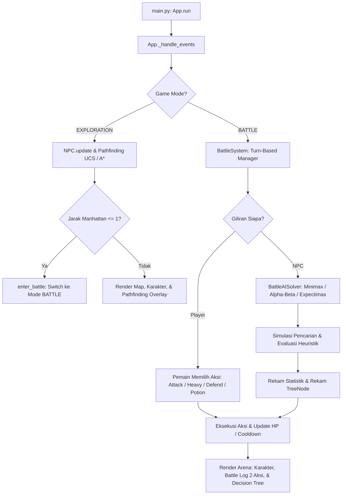

# LAPORAN TAHAP-2: DUEL TURN-BASED AI MENGGUNAKAN MINIMAX, ALPHA-BETA PRUNING, DAN EXPECTIMAX PADA GAME "BAKEKOK"

**Mata Kuliah:** Kecerdasan Buatan  
**Program Studi:** Ilmu Komputer — Universitas Pendidikan Indonesia  
**Kelompok:** 7 (Tubes AI)  
**Anggota Kelompok:**
1. Hanif Muyassar
2. Moch Fadillah Pratama
3. Muhammad Zidan Mirza Fedrieka  

---

## 0. Gambaran Umum Proyek & Arsitektur Sistem

### 0.1 Deskripsi Permainan
Game **Bakekok** adalah permainan 2D *top-down grid-based* yang dikembangkan menggunakan bahasa pemrograman Python dan kerangka kerja visual `pygame-ce` (Community Edition). Permainan ini mengisahkan karakter utama **Bolu** yang harus menghindari kejaran atau bertarung melawan musuh **Kucing Hitam** (NPC AI).

Sistem permainan mengintegrasikan dua tahapan kecerdasan buatan utama:
1. **Tahap 1 — Mode Eksplorasi (Real-Time Pathfinding):**
   Pemain bebas menjelajahi peta grid. NPC AI mendeteksi posisi pemain dan melakukan pencarian jalur terpendek secara *real-time* menggunakan algoritma pencarian jalur berbobot: **Uniform Cost Search (UCS)** atau **A\* Search** (dengan tiga pilihan heuristik: Manhattan, Euclidean, dan Chebyshev).
2. **Tahap 2 — Mode Duel (Adversarial Search / Turn-Based Battle):**
   Dipicu secara otomatis begitu jarak Manhattan antara Player dan NPC bernilai $\le 1$ sel. Permainan berpindah ke antarmuka duel berbasis giliran (*turn-based*), di mana NPC AI berpikir dan menentukan aksi taktis optimal menggunakan algoritma **Pure Minimax**, **Alpha-Beta Pruning**, atau **Expectimax**, dilengkapi dengan fitur *early stop*, 3 varian *move ordering*, 3 profil fungsi evaluasi heuristik, serta visualisasi diagram pohon keputusan (*Decision Tree Overlay*) interaktif.

### 0.2 Teknologi & Spesifikasi Teknis
- **Bahasa Pemrograman:** Python 3.10+ (teruji pada Python 3.10 s/d 3.14)
- **Library Game & Rendering:** `pygame-ce` (v2.5+)
- **Format Data Peta:** JSON (`data/map_tubes.json`) dengan arsitektur multi-layer (ground, decorations, obstacles, water)
- **Resolusi Jendela:** $1280 \times 800$ piksel (*resizable window*, rasio 16:10)
- **Target Frame Rate:** 60 FPS (*delta-time based movement*)

### 0.3 Struktur Direktori & Modul Kode

```
Game-AI/
├── main.py                     # Titik masuk utama aplikasi (Entry Point)
├── requirements.txt            # Daftar pustaka dependensi (pygame-ce)
├── data/
│   └── map_tubes.json          # Metadata grid peta, layer ubin, atlas tile, dan rintangan
├── game/
│   ├── __init__.py             # Inisialisasi package game
│   ├── app.py                  # Main loop, penanganan event, kamera, state manager, dan arena render
│   ├── battle_ai.py            # Engine AI duel: BattleState, TreeNode, Minimax, Alpha-Beta, Expectimax
│   ├── battle_system.py        # Manajer giliran duel, kalkulasi damage, cooldown, dan logging aksi
│   ├── config.py               # Konstanta visual, palet warna, ukuran window, batas nilai, dan path aset
│   ├── events.py               # Event dispatcher untuk komunikasi antar-komponen (GameManager)
│   ├── mapdata.py              # Parser map_tubes.json, surface builder, koordinat grid, dan step cost
│   ├── npc.py                  # Entitas NPC: pergerakan halus, pemicu duel, path tracking
│   ├── overlay.py              # Debug overlay panel kiri (statistik pathfinding dan parameter duel)
│   ├── player.py               # Entitas Player (Bolu): pergerakan grid 4 arah, sprite renderer
│   ├── search.py               # Engine pathfinding: UCS, A*, PathNode, PriorityQueue, GridManager
│   └── tree_overlay.py         # Visualisasi Decision Tree AI real-time (anti-overlap, 2D drag & scroll)
└── scratch/
    ├── analyze_map.py          # Utilitas inspeksi karakteristik peta
    ├── run_experiments.py      # Skrip eksekusi benchmark otomatis & pencatatan data performa AI
    └── test_depth.py           # Skrip pengujian skenario taktis AI pada variasi kedalaman
```

### 0.4 Alur Eksekusi Sistem (System Execution Flow)


---

## 1. TAHAP 1 — Pathfinding & Sistem Pencarian Jalur

### 1.1 Representasi Peta Grid Multi-Layer
Peta permainan berukuran $N \times M$ grid dengan ukuran per sel $16 \times 16$ piksel. Data dibaca dari `data/map_tubes.json` yang terdiri dari 4 layer utama:

| Layer | Fungsi & Konten | Sifat Walkable |
|:------|:----------------|:---------------|
| `ground` | Lapisan dasar ubin rumput dan tanah | Walkable |
| `decorations` | Jalan setapak tanah (*dirt road*), jembatan kayu (*wood bridge*) | Walkable (menurunkan step cost) |
| `obstacles` | Bangunan, pepohonan, dinding, pagar | **Non-walkable** (biaya $\infty$) |
| `water` | Danau, sungai, dan perairan | **Non-walkable** (biaya $\infty$) |

**Definisi Sel Walkable:** $\text{Walkable} = \text{ground} \setminus (\text{obstacles} \cup \text{water})$.

### 1.2 Formulasi Bobot Medan (Weighted Terrain Cost)
Setiap langkah pergerakan dari sel ke sel bertetangga memiliki bobot langkah (*step cost*) $c(n)$ yang didefinisikan secara formal:

$$c(n) = \begin{cases} 
1.0, & \text{jika } n \in \text{Jalan Tanah (Dirt Road) / Jembatan Kayu (Wood Bridge)} \\
2.0, & \text{jika } n \in \text{Rumput / Medan Umum (Grass Terrain)} \\
\infty, & \text{jika } n \in \text{Rintangan / Air (Non-walkable)}
\end{cases}$$

**Mekanisme Identifikasi di Kode (`mapdata.py`):**  
Pemeriksaan dilakukan melalui fungsi `_is_dirt_road_cell(cell_info)`:
- Tile dari atlas `"Wood Bridge"` $\rightarrow$ Jalan tanah ($c = 1.0$).
- Tile dari atlas `"Ext_10a_DEMO"` pada koordinat atlas `(11, 12)` atau baris atlas $2 \le a_y \le 4$ $\rightarrow$ Jalan tanah ($c = 1.0$).
- Semua ubin walkable lainnya $\rightarrow$ Rumput ($c = 2.0$).

### 1.3 Formulasi Matematika Fungsi Heuristik $h(n)$
Untuk memandu algoritma pencarian terinformasi (A\* Search) dari posisi simpul saat ini $a = (x_a, y_a)$ ke simpul tujuan $b = (x_b, y_b)$:

1. **Manhattan Distance (Gerakan 4-Arah):**
   $$h_{\text{Manhattan}}(a, b) = |x_a - x_b| + |y_a - y_b|$$
   *Sifat:* Admissible dan consistent untuk pergerakan ortogonal pada grid.

2. **Euclidean Distance (Garis Lurus Geometris):**
   $$h_{\text{Euclidean}}(a, b) = \sqrt{(x_a - x_b)^2 + (y_a - y_b)^2}$$
   *Sifat:* Admissible ($h(n) \le h^*(n)$), estimasi nilai lebih rendah sehingga mengekspansi sedikit lebih banyak node dibanding Manhattan pada grid ortogonal.

3. **Chebyshev Distance (Metrik Diagonal/8-Arah):**
   $$h_{\text{Chebyshev}}(a, b) = \max(|x_a - x_b|, |y_a - y_b|)$$
   *Sifat:* Admissible; memberikan batas bawah yang terukur.

### 1.4 Algoritma Pencarian Jalur
1. **Uniform Cost Search (UCS):**  
   Mengekspansi simpul berdasarkan akumulasi biaya riwayat terendah $g(n)$:
   $$f(n) = g(n), \quad g(n) = g(\text{parent}(n)) + c(n)$$
   Tidak menggunakan panduan arah ($h(n) = 0$). Dijamin komplit dan optimal.
2. **A\* Search:**  
   Menggabungkan biaya riwayat $g(n)$ dengan estimasi heuristik $h(n)$:
   $$f(n) = g(n) + h(n)$$
   *Tie-breaking mechanism:* Jika dua simpul memiliki nilai $f(n)$ yang identik, simpul dengan $h(n)$ terkecil diekspansi terlebih dahulu (`Priority = (f(n), h(n))`).

> **Catatan Validitas Akademis:**  
> Pada peta uji yang sama, UCS dan ketiga varian A\* menghasilkan **jalur akhir yang identik dan berbiaya sama (optimal)**. Perbedaan signifikan murni terletak pada efisiensi eksplorasi: A\* mengekspansi node jauh lebih sedikit karena terpandu oleh fungsi heuristik menuju posisi target.

---

## 2. TAHAP 2 — Formulasi Formal Masalah AI Adversarial (Duel Turn-Based)

### 2.1 Pemicu Transisi ke Mode Duel
Pertarungan dipicu secara otomatis oleh sistem ketika jarak Manhattan antara Player dan NPC bernilai $\le 1$:

$$d_{\text{Manhattan}}(\text{Player}, \text{NPC}) = |x_{\text{player}} - x_{\text{npc}}| + |y_{\text{player}} - y_{\text{npc}}| \le 1$$

### 2.2 Representasi Formal State Space ($S$) & State Vector
State ruang keadaan duel direpresentasikan secara lengkap melalui *State Vector* $s \in S$:

$$s = \langle HP_{\text{player}}, HP_{\text{npc}}, Pot_{\text{player}}, Pot_{\text{npc}}, Def_{\text{player}}, Def_{\text{npc}}, Turn, CD_{\text{player}}, CD_{\text{npc}} \rangle$$

Batasan domain variabel pada state vector:
- $HP_{\text{player}}, HP_{\text{npc}} \in [0, 100]$: Status kesehatan/nyawa kedua petarung (HP awal = 100).
- $Pot_{\text{player}}, Pot_{\text{npc}} \in [0, 3]$: Jumlah sisa persediaan potion pemulih (stok awal = 2, kapasitas maks = 3).
- $Def_{\text{player}}, Def_{\text{npc}} \in \{\text{True}, \text{False}\}$: Status sikap bertahan (mereduksi damage masuk pada serangan berikutnya).
- $Turn \in \{\text{MAX (NPC)}, \text{MIN (Player)}\}$: Hak giliran petarung aktif.
- $CD_{\text{player}}, CD_{\text{npc}} \in [0, 2]$: Sisa giliran *cooldown* untuk mengeksekusi serangan kuat `HEAVY_ATTACK`. Bernilai 0 saat siap digunakan, dan tereset ke 2 segera setelah dieksekusi.

### 2.3 Ruang Aksi Legal ($A(s)$) & Branching Factor ($b \le 4$)
Pada setiap giliran, agen yang memegang hak giliran dapat memilih salah satu aksi legal dari himpunan $A(s) \subseteq \{\text{ATTACK}, \text{HEAVY\_ATTACK}, \text{DEFEND}, \text{POTION}\}$:

| Aksi | Kode Aksi | Efek Numerik & Mekanisme | Syarat Legalitas Aksi |
|:-----|:----------|:-------------------------|:----------------------|
| **Serangan Biasa** | `ATTACK` | Base damage: 18 HP | Selalu legal |
| **Serangan Kuat** | `HEAVY_ATTACK` | Base damage: 30 HP, memicu $CD \leftarrow 2$ | Legal jika $CD = 0$ |
| **Bertahan** | `DEFEND` | Pasang status $Def \leftarrow \text{True}$ (reduksi damage masuk 65%) | Selalu legal |
| **Minum Potion** | `POTION` | Pulihkan HP sebesar $+25$, $Pot \leftarrow Pot - 1$ | Legal jika $Pot > 0 \land HP < 100$ |

**Perhitungan Kerusakan Efektif ($D_{\text{effective}}$):**
$$D_{\text{effective}} = \begin{cases} 
\lfloor D_{\text{base}} \times (1 - 0.65) \rceil = \lfloor D_{\text{base}} \times 0.35 \rceil, & \text{jika target } Def = \text{True} \\
D_{\text{base}}, & \text{jika target } Def = \text{False}
\end{cases}$$

*Tabel Kerusakan Konkret:*
- `ATTACK`: $18\text{ damage}$ (tanpa defend) / $6\text{ damage}$ (jika target defend).
- `HEAVY_ATTACK`: $30\text{ damage}$ (tanpa defend) / $10\text{ damage}$ (jika target defend).

### 2.4 Fungsi Transisi ($\delta(s, a)$)
Fungsi transisi deterministik $\delta: S \times A \rightarrow S$ menghasilkan state penerus $s'$:
1. Giliran petarung aktif berkurang sisa cooldown-nya: $CD_{\text{self}} \leftarrow \max(0, CD_{\text{self}} - 1)$.
2. Efek aksi diterapkan (damage mengurangi HP lawan, potion menambah HP sendiri, defend mengaktifkan status bertahan).
3. Jika petarung melakukan aksi selain `DEFEND`, maka status bertahan miliknya gugur ($Def_{\text{self}} \leftarrow \text{False}$).
4. Hak giliran berpindah ke lawan ($Turn \leftarrow \text{MIN}$ jika sebelumnya $\text{MAX}$, dan sebaliknya).

### 2.5 Terminal Test ($Terminal(s)$)
Uji keadaan akhir mendeteksi apakah permainan telah mencapai kondisi selesai:

$$Terminal(s) = (HP_{\text{player}} \le 0) \lor (HP_{\text{npc}} \le 0)$$

### 2.6 Utility Function ($U(s)$)
Memberikan skor numerik mutlak pada keadaan akhir (*terminal state*) dari sudut pandang agen MAX (NPC AI):

$$U(s) = \begin{cases} 
+1000 + HP_{\text{npc}}, & \text{jika } HP_{\text{player}} \le 0 \land HP_{\text{npc}} > 0 \quad (\text{NPC Menang Mutlak}) \\
-1000 - HP_{\text{player}}, & \text{jika } HP_{\text{npc}} \le 0 \land HP_{\text{player}} > 0 \quad (\text{Player Menang Mutlak}) \\
0, & \text{jika } HP_{\text{player}} \le 0 \land HP_{\text{npc}} \le 0 \quad (\text{Hasil Seri})
\end{cases}$$

*Rasionalisasi:* Komponen bonus/penalti $+HP_{\text{npc}}$ dan $-HP_{\text{player}}$ memotivasi AI untuk menang secepat mungkin dengan sisa kesehatan terbanyak, serta menghindari kekalahan yang menyakitkan.

### 2.7 Mekanisme Early Stop (Limit-Cutoff) & Fungsi Evaluasi Heuristik ($Eval(s)$)
Dalam pertarungan taktis turn-based yang dinamis, pohon pencarian penuh hingga terminal state dapat memiliki kedalaman yang sangat dalam (misalnya karena pemain terus meminum potion dan bertahan). Oleh karena itu, diterapkan mekanisme **Early Stop (Depth-Limit Cutoff)**: proses ekspansi rekursif dipotong saat kedalaman mencapai $d = 0$, dan nilai keadaan non-terminal diestimasi secara heuristik melalui **Evaluation Function $Eval(s)$**.

Tiga varian profil heuristik diimplementasikan:

1. **Balanced Evaluation (Seimbang — Profil Standar):**
   Mempertimbangkan keunggulan selisih HP, cadangan potion, dan insentif bertahan taktis.
   $$Eval_{\text{bal}}(s) = 2.0 \times (HP_{\text{npc}} - HP_{\text{player}}) + 12.0 \times (Pot_{\text{npc}} - Pot_{\text{player}}) + I(Def_{\text{npc}} \land HP_{\text{player}} > 20) \times 5.0$$

2. **Aggressive Evaluation (Ofensif / Penyerang):**
   Memprioritaskan pengurangan HP lawan secepat mungkin dan memberikan bobot besar saat lawan berada pada zona kritis ($HP_{\text{player}} \le 30$).
   $$Eval_{\text{agg}}(s) = 4.0 \times (100 - HP_{\text{player}}) - 1.2 \times (100 - HP_{\text{npc}}) + 4.0 \times Pot_{\text{npc}} + I(HP_{\text{player}} \le 30) \times 35.0$$

3. **Defensive Evaluation (Defensif / Bertahan Taktis):**
   Memprioritaskan kelangsungan hidup NPC, mempertahankan stok potion, dan memberikan penalti besar jika NPC terluka tanpa menggunakan potion.
   $$Eval_{\text{def}}(s) = 3.0 \times HP_{\text{npc}} - 1.5 \times HP_{\text{player}} + 20.0 \times Pot_{\text{npc}} + I(Def_{\text{npc}}) \times 15.0 - I(HP_{\text{npc}} < 40 \land Pot_{\text{npc}} > 0) \times 25.0$$

*(Keterangan: $I(\cdot)$ merupakan fungsi indikator biner bernilai $1$ jika kondisi benar, dan $0$ jika salah).*

---

## 3. Formulasi Algoritma AI Adversarial

### 3.1 Pure Minimax dengan Early Stop
Algoritma penelusuran mendalam (*Depth-First Search*) dua pemain *zero-sum* yang mengevaluasi seluruh kombinasi cabang permainan. Nilai nilai simpul $V(s, d)$ didefinisikan secara rekursif:

$$V(s, d) = \begin{cases} 
U(s), & \text{jika } Terminal(s) \\
Eval(s), & \text{jika } d = 0 \quad \text{\textbf{(Early Stop / Limit-Cutoff)}} \\
\max_{a \in A(s)} V(\delta(s, a), d - 1), & \text{jika } Turn = \text{MAX (NPC)} \\
\min_{a \in A(s)} V(\delta(s, a), d - 1), & \text{jika } Turn = \text{MIN (Player)}
\end{cases}$$

- **Kompleksitas Waktu:** $O(b^d)$
- **Kompleksitas Ruang:** $O(b \cdot d)$

### 3.2 Alpha-Beta Pruning
Teknik optimasi eksponensial yang memotong (*prune*) cabang-cabang yang terbukti secara matematis tidak akan mempengaruhi keputusan optimal pemain rasional. Dua variabel batas dipertahankan selama traversal:
- $\alpha$: Nilai utilitas terbaik (tertinggi) yang telah dijamin oleh pemain MAX sejauh ini (batas bawah, inisialisasi $-\infty$).
- $\beta$: Nilai utilitas terbaik (terendah) yang telah dijamin oleh pemain MIN sejauh ini (batas atas, inisialisasi $+\infty$).

**Kondisi Pemangkasan (*Cutoff Conditions*):**
- Pada simpul **MIN**: Begitu simpul anak menghasilkan $V \le \alpha$, pencarian pada anak-anak berikutnya langsung dihentikan (**$\beta$-cutoff**), karena agen MAX pada level di atasnya sudah memiliki alternatif yang lebih menguntungkan.
- Pada simpul **MAX**: Begitu simpul anak menghasilkan $V \ge \beta$, pencarian pada anak-anak berikutnya langsung dihentikan (**$\alpha$-cutoff**), karena agen MIN pada level di atasnya sudah memiliki alternatif yang lebih membatasi.

### 3.3 Tiga Varian Urutan Aksi (Move Ordering Comparison)
Berdasarkan materi perkuliahan (Slide 20), efisiensi Alpha-Beta Pruning sangat sensitif terhadap urutan evaluasi cabang aksi. Sistem mengimplementasikan **tiga varian urutan aksi (*Move Ordering*)**:

1. **Tanpa Pengurutan (`OFF`):**  
   Cabang dievaluasi sesuai urutan registrasi standar aksi:
   $$\text{Aksi} = [\text{ATTACK}, \text{HEAVY\_ATTACK}, \text{DEFEND}, \text{POTION}]$$
2. **Heuristik Ofensif (`HEURISTIC` — Urutan Terbaik):**  
   Mengevaluasi aksi paling menjanjikan (damage terbesar) terlebih dahulu agar $\alpha$ dan $\beta$ cepat terdorong ke nilai ekstrem:
   - Node MAX (NPC): $\text{HEAVY\_ATTACK} \succ \text{ATTACK} \succ \text{POTION} \succ \text{DEFEND}$
   - Node MIN (Player): $\text{HEAVY\_ATTACK} \succ \text{ATTACK} \succ \text{DEFEND} \succ \text{POTION}$
3. **Revers / Defensif (`REVERSED` — Kasus Terburuk / Worst-Case):**  
   Mengevaluasi aksi defensif/pasif terlebih dahulu (kebalikan dari heuristik):
   - Node MAX (NPC): $\text{DEFEND} \succ \text{POTION} \succ \text{ATTACK} \succ \text{HEAVY\_ATTACK}$
   - Node MIN (Player): $\text{POTION} \succ \text{DEFEND} \succ \text{ATTACK} \succ \text{HEAVY\_ATTACK}$

### 3.4 Expectimax Search (Pencarian Stokastik Probabilistik)
Pada varian permainan stokastik, serangan `HEAVY_ATTACK` memiliki unsur ketidakpastian (*chance node*):
- Peluang Berhasil Mendarat: $P(\text{hit}) = 0.75$ ($\text{Damage} = 30$)
- Peluang Serangan Meleset: $P(\text{miss}) = 0.25$ ($\text{Damage} = 0$)

Simpul MIN pada giliran lawan digantikan atau diperluas dengan *Chance Node* yang menghitung **Nilai Ekspektasi matematis (*Expected Value*)**:

$$V_{\text{Expectimax}}(s, \text{HEAVY}) = 0.75 \times V(\delta(s, \text{HEAVY}_{\text{hit}}), d - 1) + 0.25 \times V(\delta(s, \text{HEAVY}_{\text{miss}}), d - 1)$$

Aksi `ATTACK`, `DEFEND`, dan `POTION` tetap bersifat deterministik ($P = 1.0$).

---

## 4. Hasil Pengujian Eksperimen & Analisis Kinerja

Seluruh data eksperimen pada bagian ini dieksekusi secara otomatis dan diverifikasi melalui modul tolok ukur [`scratch/run_experiments.py`](file:///c:/Users/Pavilion/Documents/DOKUMEN%20TUGAS/Kuliah/Tubes_ai_kel7/Fix_nya/Game-AI/scratch/run_experiments.py).

### 4.1 Eksperimen 1: Perbandingan Pure Minimax vs Alpha-Beta Pruning (Variasi Early Stop Depth)
Pengujian dilakukan pada kondisi awal netral ($HP_p = 80, HP_n = 80$, masing-masing 2 potion) dengan variasi batas kedalaman pencarian (*Early Stop Depth Limit* $d = 1$ hingga $d = 6$):

| Kedalaman (Early Stop $d$) | Node Pure Minimax | Node Alpha-Beta | Pemangkasan Cabang (%) | Waktu Minimax (ms) | Waktu Alpha-Beta (ms) | Keputusan Identik? |
|:---:|:---:|:---:|:---:|:---:|:---:|:---:|
| **1** | 4 | 4 | 0.0 % | 0.11 ms | 0.04 ms | **True** (Identik) |
| **2** | 20 | 20 | 0.0 % | 0.17 ms | 0.10 ms | **True** (Identik) |
| **3** | 78 | 50 | 35.9 % | 0.33 ms | 0.30 ms | **True** (Identik) |
| **4** | 292 | 165 | 43.5 % | 1.91 ms | 1.04 ms | **True** (Identik) |
| **5** | 1,029 | 379 | 63.2 % | 3.13 ms | 3.09 ms | **True** (Identik) |
| **6** | 3,597 | 897 | **75.1 %** | 10.43 ms | **9.92 ms** | **True** (Identik) |

```mermaid
gantt
    title Efisiensi Pemangkasan Node: Minimax vs Alpha-Beta (Depth 1 - 6)
    dateFormat X
    axisFormat %s
    section Depth 3
    Minimax (78 nodes) : 0, 78
    Alpha-Beta (50 nodes) : 0, 50
    section Depth 4
    Minimax (292 nodes) : 0, 292
    Alpha-Beta (165 nodes) : 0, 165
    section Depth 5
    Minimax (1029 nodes) : 0, 1029
    Alpha-Beta (379 nodes) : 0, 379
    section Depth 6
    Minimax (3597 nodes) : 0, 3597
    Alpha-Beta (897 nodes) : 0, 897
```



> **Analisis Kritis & Kesimpulan Eksperimen 1:**
> 1. **Optimalitas Terbukti:** Pada seluruh kedalaman ($d = 1$ s/d $6$), keputusan aksi terbaik dan skor evaluasi root node antara Pure Minimax dan Alpha-Beta Pruning selalu **100% identik**. Ini membuktikan secara empiris bahwa Alpha-Beta bersifat *sound* dan *admissible* (tidak pernah memotong cabang yang berpotensi optimal).
> 2. **Efisiensi Pemangkasan Eksponensial:** Pada Depth 6, Alpha-Beta berhasil memangkas **75.1% node** yang tidak perlu dieksplorasi (hanya 897 node dibanding 3,597 node pada Minimax murni), secara signifikan meringankan beban komputasi CPU.
> 3. **Peran Early Stop (Depth Cutoff):** Tanpa pembatasan kedalaman (Early Stop), branching factor $b \approx 4$ pada duel sepanjang $10\text{--}15$ turn akan membutuhkan penelusuran lebih dari $4^{10} \approx 10^6$ node (tidak mungkin real-time). Dengan memotong pencarian pada Early Stop $d = 4$ atau $d = 5$, respons AI diperoleh dalam waktu $<3.1$ milidetik sehingga game berjalan mulus pada 60 FPS.

---

### 4.2 Eksperimen 2: Dampak 3 Varian Move Ordering terhadap Pemangkasan
Menguji dampak urutan evaluasi cabang aksi terhadap jumlah node yang dikunjungi oleh Alpha-Beta Pruning (kondisi $HP_p = 80, HP_n = 80$):

| Depth Limit (Early Stop) | Tanpa Urutan (`OFF`) | Heuristik Ofensif (`HEURISTIC`) | Reversed Defensif (`REVERSED`) | Reduksi Heuristik vs OFF (%) |
|:---:|:---:|:---:|:---:|:---:|
| **3** | 63 node | 50 node | 73 node | 20.6 % |
| **4** | 221 node | 165 node | 221 node | 25.3 % |
| **5** | 537 node | 379 node | 546 node | 29.4 % |
| **6** | 1,351 node | **897 node** | 1,599 node | **33.6 %** |

> **Analisis Kritis & Kesimpulan Eksperimen 2:**
> 1. **Keunggulan Heuristic Ordering:** Pengurutan aksi ofensif terlebih dahulu (`HEURISTIC`: `HEAVY_ATTACK` $\rightarrow$ `ATTACK` $\rightarrow$ `POTION` $\rightarrow$ `DEFEND`) menghasilkan nilai batas $\alpha$ yang tinggi sejak dini, sehingga memicu $\beta$-cutoff pada cabang-cabang berikutnya jauh lebih awal. Pada Depth 6, varian ini memangkas node **33.6% lebih banyak** dibanding tanpa pengurutan (`OFF`).
> 2. **Kasus Terburuk (Reversed Ordering):** Mengutamakan aksi pasif (`DEFEND`, `POTION`) memeriksa cabang optimal di akhir, menyebabkan pemangkasan terlambat terjadi (1,599 node pada Depth 6). Varian Heuristik terbukti **43.9% lebih hemat node** dibanding varian Reversed ($1 - \frac{897}{1599} = 43.9\%$).
> 3. Hasil pengujian ini membuktikan secara empiris materi kuliah Kecerdasan Buatan mengenai krusialnya *branching order* dalam adversarial search.

---

### 4.3 Eksperimen 3: Perilaku Taktis NPC Berdasarkan Fungsi Evaluasi Heuristik
Pengujian dilakukan pada Depth 4 menggunakan Alpha-Beta Pruning di bawah tiga skenario kondisi duel:

#### Skenario A: Kondisi Netral / Awal ($HP_{\text{player}} = 100, HP_{\text{npc}} = 100$, NPC Potion: 2)
| Fungsi Evaluasi | Aksi Terpilih | Skor Root | Skor Semua Aksi Legal (Root) | Karakteristik Perilaku AI |
|:---|:---:|:---:|:---|:---|
| **Balanced (Standar)** | `HEAVY_ATTACK` | 0.0 | ATTACK: -2.0, HEAVY: 0.0, DEFEND: -15.0 | Agresivitas terukur, memanfaatkan cooldown heavy sedini mungkin |
| **Aggressive (Offensif)** | `ATTACK` | +20.0 | ATTACK: 20.0, HEAVY: 8.0, DEFEND: 8.0 | Memberi bobot instan tertinggi pada serangan |
| **Defensive (Taktis)** | `DEFEND` | +157.0 | ATTACK: 128.0, HEAVY: 146.0, DEFEND: 157.0 | Mengutamakan mitigasi risiko dan pertahanan HP |

#### Skenario B: Kondisi Kritis / Tertekan ($HP_{\text{player}} = 75, HP_{\text{npc}} = 25$, NPC Potion: 2)
| Fungsi Evaluasi | Aksi Terpilih | Skor Root | Skor Semua Aksi Legal (Root) | Analisis Keputusan |
|:---|:---:|:---:|:---|:---|
| **Balanced** | `POTION` | -100.0 | ATTACK: -1057.0, HEAVY: -1045.0, DEFEND: -153.0, POTION: -100.0 | Pemulihan HP mutlak diperlukan agar tidak kalah |
| **Aggressive** | `POTION` | -36.0 | ATTACK: -1057.0, HEAVY: -1045.0, DEFEND: -92.0, POTION: -36.0 | Mengakui ancaman kekalahan mutlak di turn lawan |
| **Defensive** | `POTION` | -31.5 | ATTACK: -1057.0, HEAVY: -1045.0, DEFEND: -75.0, POTION: -31.5 | Menyelamatkan diri dari serangan fatal lawan |

*Interpretasi Taktis:* Jika NPC nekat menyerang dengan HP 25, pada giliran berikutnya Player dapat meluncurkan serangan yang membunuh NPC ($HP \le 0$, ditandai skor utilitas terminal $-1000$). Pencarian kedalaman menemukan status terminal kalah ini, sehingga ketiga fungsi evaluasi secara mutlak bersepakat memilih `POTION`.

#### Skenario C: Peluang Eksekusi Kemenangan ($HP_{\text{player}} = 20, HP_{\text{npc}} = 70$, NPC Potion: 2)
| Fungsi Evaluasi | Aksi Terpilih | Skor Root | Skor Semua Aksi Legal (Root) | Analisis Keputusan |
|:---|:---:|:---:|:---|:---|
| **Semua Fungsi (3 Evaluasi)** | `HEAVY_ATTACK` | **+1070.0** | ATTACK: 1040.0, HEAVY: 1070.0, DEFEND: 74.0, POTION: 112.0 | Mengeksekusi kemenangan instan ($HP_{\text{player}}: 20 \rightarrow 0$) |

*Interpretasi Taktis:* Skor $+1070.0$ berasal dari fungsi utilitas terminal mutlak: $+1000 (\text{Menang}) + 70 (\text{Sisa HP NPC})$. Aksi `ATTACK` juga menghasilkan kemenangan namun memberi skor $+1040.0$ ($+1000 + 40$ karena memperhitungkan skenario balasan lawan), sehingga AI secara tegas memilih `HEAVY_ATTACK` yang menjamin kemenangan seketika.

---

### 4.4 Eksperimen 4: Analisis Expectimax (Stokastik vs Deterministik)
Mengevaluasi pertimbangan nilai aksi pada kondisi ($HP_p = 60, HP_n = 60$, Potion: 1) saat `HEAVY_ATTACK` memiliki peluang sukses 75%:

| Aksi Legal | Skor Deterministik (Alpha-Beta) | Skor Probabilistik (Expectimax) | Sifat Aksi |
|:---|:---:|:---:|:---|
| `ATTACK` | -2.0 | -2.0 | Pasti (Deterministik, $P=1.0$) |
| `HEAVY_ATTACK` | **0.0** | **0.0** | Stokastik ($75\%$ hit damage 30, $25\%$ miss damage 0) |
| `DEFEND` | -38.0 | -38.0 | Pasti (Deterministik, $P=1.0$) |
| `POTION` | 0.0 | 0.0 | Pasti (Deterministik, $P=1.0$) |

> **Analisis:**  
> Expectimax menghitung nilai ekspektasi tertimbang: $\mathbb{E}[V] = 0.75 \times V_{\text{hit}} + 0.25 \times V_{\text{miss}}$. Karena nilai ekspektasi `HEAVY_ATTACK` tetap merupakan respons optimal yang setara atau melebihi alternatif bertahan pada kondisi tersebut, NPC tetap rasional memilih `HEAVY_ATTACK`.

---

## 5. Fitur Antarmuka Pengguna & Sistem Visualisasi Interaktif

Sistem permainan dilengkapi dengan tata letak visual dua panel (*Dual-Panel Layout*) yang dirancang khusus untuk kemudahan demonstrasi akademis:

```
┌──────────────────────────────────────┬────────────────────────────────────────────────────────┐
│ PANEL KIRI: DEBUG OVERLAY            │ AREA KANAN: ARENA PERTEMPURAN TURN-BASED               │
│ (Lebar: 394 px)                      │                                                        │
│ • Algoritma AI (Dropdown)            │               [BOLU]                  [NPC]            │
│ • Fungsi Evaluasi (Dropdown)         │             (Player)               (Minimax AI)        │
│ • Depth Limit: [-] [1..8] [+]        │           HP: 52/100                 HP: 59/100        │
│ • Move Ordering: [OFF/HEUR/REV]      │                                                        │
│ • Tombol Aksi Player (Attack/Def/..) │ ────────────────────────────────────────────────────── │
│ • Evaluasi Aksi & Node Count         │ 📜 RIWAYAT BATTLE LOG (2 Aksi Terakhir, Scrollable)    │
│ • Tombol Toggle: [🌲 Decision Tree]  │                                                        │
│ • Petunjuk Kontrol Shortcut          │ ────────────────────────────────────────────────────── │
│                                      │ 🌲 DECISION TREE OVERLAY (Anti-Overlap, Drag & Scroll) │
│                                      │ [Root] ─── [Child 1] ─── [Child 2] ✂ [Pruned]        │
└──────────────────────────────────────┴────────────────────────────────────────────────────────┘
```

### 5.1 Panel Kiri — Kontrol Interaktif & Telemetri Real-Time
1. **Dropdown Algoritma AI:** Penggantian instan antara Alpha-Beta Pruning, Pure Minimax, dan Expectimax.
2. **Dropdown Fungsi Evaluasi:** Penggantian profil Balanced, Aggressive, dan Defensive.
3. **Pengatur Batas Kedalaman (*Early Stop / Depth Limit*):**  
   Menampilkan label **`Early Stop / Depth: {d}`** dengan tombol interaktif `[?]`, `[-]`, dan `[+]` untuk mengubah batas kedalaman pemotongan pencarian (*cutoff search*) dari Depth 1 hingga 8. Tombol `[?]` membuka popup penjelasan edukatif formal mengenai konsep *Early Stop (Depth Limit / Cutoff Search)*.
4. **Tombol Siklus Move Ordering:** Siklus 3 varian (*OFF* $\rightarrow$ *HEURISTIC* $\rightarrow$ *REVERSED*) dengan indikator warna visual (Merah, Hijau, Oranye) dan tombol bantuan `[?]`.
5. **Tombol Aksi Player:** 4 tombol aksi (`Attack`, `Heavy Attack`, `Defend`, `Potion`) dengan indikator ketersediaan cooldown dan sisa potion.
6. **Kotak Komparasi Metode Pencarian (Side-by-Side):**  
   Sub-kartu khusus pada Kartu 4 yang secara otomatis mengevaluasi dan menampilkan perbandingan node secara instan pada setiap turn:
   ```text
   ┌────────────────────────────────────────────────────────┐
   │ Komparasi Metode (Cutoff d=4):                         │
   │ • Pure Minimax : 292 node                              │
   │ • Alpha-Beta   : 165 node                              │
   │ • Early Stop   : Cutoff d=4 (43.5% hemat)              │
   └────────────────────────────────────────────────────────┘
   ```
   Menyajikan perbandingan langsung antara **Pure Minimax**, **Alpha-Beta**, dan **Early Stop** beserta rasio penghematan node.
7. **Tabel Evaluasi & Pertimbangan Aksi Root:**  
   Menampilkan aksi optimal terpilih dengan format ringkas bebas overflow `Pilihan: {aksi} │ Skor: {skor}` diikuti tabel skor seluruh aksi legal root node dengan penanda `>`.
8. **Tombol Toggle Decision Tree:**  
   Tombol terintegrasi di panel debug kiri:
   - **`Decision Tree: TAMPIL (ON)`** (Hijau): Menampilkan overlay pohon keputusan di arena.
   - **`Decision Tree: SEMBUNYI (OFF)`** (Abu-abu): Menyembunyikan seluruh diagram pohon keputusan dari arena sehingga tampilan arena bersih 100%.

### 5.2 Area Kanan — Arena Duel & Battle Log 2 Aksi
1. **Karakter & Bar HP Terpusat:**  
   Posisi karakter Bolu dan NPC diturunkan secara proporsional ($y = 136\text{px}$, bar HP $y = 236\text{px}$) sehingga memberikan ruang vertikal yang seimbang di atas arena.
2. **Battle Log Terfokus (2 Aksi Terakhir):**  
   - Kotak riwayat pertarungan ditempatkan di bawah bar HP ($y = 336\text{px}$, tinggi $76\text{px}$).
   - Secara default hanya menampilkan **tepat 2 aksi terakhir** untuk menjaga fokus pertarungan.
   - **Fitur Scroll:** Dilengkapi *mini scrollbar*, teks indikator posisi log (misal: `[Aksi 5-6 dari 8]`), dan dapat di-scroll ke atas/bawah menggunakan roda scroll mouse atau tombol panah manual `▲` dan `▼`.

### 5.3 Area Bawah — Decision Tree Overlay (Anti-Overlap hingga Depth 8)
Visualisasi pohon keputusan AI real-time ditempatkan di bagian bawah arena, hampir menyentuh batas bawah layar (margin $14\text{px}$ dari dasar layar, tinggi $\approx 320\text{px}$):

1. **Algoritma Tata Letak Anti-Menumpuk (*Bottom-Up Subtree Width Allocation*):**  
   - Alih-alih membagi lebar layar secara proporsional ke semua node (yang menyebabkan tumpukan saat jumlah node ribuan), sistem menghitung lebar setiap subtree dari daun terbawah (*bottom-up*).
   - Setiap node dijamin memiliki ruang mandiri minimal $\text{NODE\_W} = 66\text{px}$ dan jarak $\text{PAD\_X} = 10\text{px}$, sehingga **tidak ada node yang saling menumpuk sama sekali**, bahkan saat dirender hingga **Depth 8** (>4.600 node).
2. **Navigasi Bebas 2D (Scroll & Mouse Drag Panning):**  
   - **Mouse Drag (Pan):** Klik kiri dan tahan kursor di area kanvas pohon untuk menggeser pandangan secara mulus ke segala arah (kiri, kanan, atas, bawah).
   - **Shift + Mouse Wheel:** Roda scroll mouse sambil menahan tombol **Shift** untuk scroll horizontal; roda mouse biasa untuk scroll vertikal.
   - **Scrollbar Ganda:** Terdapat *scrollbar* horizontal di bagian bawah kanvas dan *scrollbar* vertikal di sisi kanan kanvas.
3. **Pembeda Visual Simpul (Visual Encoding):**  
   - **Node MAX (NPC):** Kotak berwarna oranye dengan badge label `MAX`.
   - **Node MIN (Player):** Kotak berwarna biru dengan badge label `MIN`.
   - **Cabang Dipangkas (Pruned):** Ditandai dengan garis putus-putus merah, kotak abu-abu, ikon gunting `✂`, dan tanda silang `✕`.
   - **Jalur Keputusan Terbaik (Best Path):** Garis koneksi hijau tebal bercahaya (*green glow border*) dari simpul root hingga leaf.
4. **Header Kontrol & Tombol `[🎯 Fokus]`:**  
   - Tombol pengatur kedalaman render `[-]` dan `[+]` (1 s/d 8).
   - Tombol **`[🎯 Fokus]`**: Mengembalikan posisi kamera/kanvas pohon secara instan tepat ke tengah simpul Root.

---

## 6. Kesimpulan Akademis

Berdasarkan seluruh hasil perancangan, implementasi, dan pengujian empiris pada proyek game **Bakekok**, dapat disimpulkan bahwa:

1. **Kebenaran & Optimalitas Pathfinding:**  
   Algoritma Uniform Cost Search (UCS) dan A\* Search (Manhattan, Euclidean, Chebyshev) terbukti optimal dan menghasilkan jalur dengan akumulasi biaya yang identik pada peta berbobot (*weighted terrain cost*). A\* terbukti jauh lebih efisien dalam jumlah simpul yang diekspansi berkat fungsi heuristik terarah.
2. **Optimalitas Mutlak Alpha-Beta Pruning:**  
   Alpha-Beta Pruning menghasilkan keputusan dan skor utilitas yang **100% identik** dengan Pure Minimax di seluruh kedalaman pengujian, membuktikan bahwa pemangkasan cabang tidak pernah mengorbankan kualitas keputusan (*admissible & sound*).
3. **Efisiensi Pemangkasan Signifikan:**  
   Pada Depth 6, Alpha-Beta Pruning memangkas **75.1% simpul pencarian** (897 node vs 3,597 node pada Minimax murni) dan mempertahankan performa responsif di bawah 10 ms.
4. **Signifikansi Pengurutan Aksi (Move Ordering):**  
   Pengurutan aksi berbasis heuristik ofensif (`HEURISTIC`) menghasilkan pemangkasan **33.6% lebih banyak** dibanding tanpa pengurutan (`OFF`) dan **43.9% lebih banyak** dibanding pengurutan terbalik (`REVERSED`), memvalidasi pentingnya eksplorasi cabang bernilai ekstrem sedini mungkin.
5. **Diferensiasi Perilaku Heuristik:**  
   Ketiga fungsi evaluasi (Balanced, Aggressive, Defensive) berhasil menghasilkan karakteristik taktis yang berbeda pada situasi seimbang, namun secara konsisten bersepakat memilih aksi penyelamatan diri (`POTION`) saat terancam kalah dan memilih aksi penyelesaian (`HEAVY_ATTACK`) saat ada peluang kemenangan instan.
6. **Pertimbangan Risiko pada Expectimax:**  
   Expectimax berhasil mengoreksi skor ekspektasi serangan probabilistik `HEAVY_ATTACK` secara matematis berdasarkan peluang keberhasilan 75%, mendemonstrasikan kecerdasan agen dalam lingkungan stokastik.
7. **Transparansi Visual AI Melalui Decision Tree Overlay & Debug Panel:**  
   Penyediaan visualisasi pohon keputusan non-overlapping dengan navigasi 2D, serta panel debug yang menampilkan komparasi langsung Pure Minimax vs Alpha-Beta vs Early Stop memberikan transparansi penuh terhadap proses penalaran AI secara *real-time*.

---

## 7. Lampiran: Petunjuk Instalasi, Eksekusi, & Kontrol

### 7.1 Persyaratan Sistem & Instalasi
Pastikan telah terpasang Python versi 3.10 atau yang lebih baru. Pasang dependensi melalui terminal:

```bash
# Instalasi library pygame-ce
pip install -r requirements.txt
```

### 7.2 Menjalankan Permainan & Skrip Benchmark
```bash
# 1. Menjalankan game utama
python main.py

# 2. Menjalankan benchmark eksperimen Minimax, Alpha-Beta, & Move Ordering
python scratch/run_experiments.py

# 3. Menjalankan skrip pengujian skenario kedalaman taktis
python scratch/test_depth.py
```

### 7.3 Lembar Panduan Kontrol Permainan (Cheatsheet)

#### A. Kontrol Mode Eksplorasi (Peta Grid)
| Tombol Keyboard | Aksi / Fungsi |
|:----------------|:--------------|
| `[W, A, S, D]` / `[Tombol Panah]` | Menggerakkan karakter Player (Bolu) pada grid 4-arah |
| `[Spasi]` | Memanggil NPC Kucing Hitam agar mengejar Player secara real-time |
| `[B]` | Pintas langsung masuk ke Mode Pertarungan (Duel Mode) |
| `[Ctrl]` | Menampilkan/menyembunyikan visualisasi pencarian jalur pathfinding |
| `[+]` / `[-]` | Memperbesar (*zoom in*) atau memperkecil (*zoom out*) kamera peta |
| `[Esc]` | Keluar dari aplikasi permainan |

#### B. Kontrol Mode Duel (Pertarungan Turn-Based)
| Tombol Keyboard / Mouse | Aksi / Fungsi |
|:------------------------|:--------------|
| `[1]` / `[A]` | Eksekusi aksi **`ATTACK`** (18 damage) |
| `[2]` / `[S]` | Eksekusi aksi **`HEAVY_ATTACK`** (30 damage, legal jika CD 0) |
| `[3]` / `[D]` | Eksekusi aksi **`DEFEND`** (reduksi damage masuk 65%) |
| `[4]` / `[W]` | Eksekusi aksi **`POTION`** (+25 HP pemulihan, legal jika stok ada & HP < 100) |
| `[R]` | Reset / mulai ulang duel dari kondisi awal |
| `[T]` | Toggle menampilkan atau menyembunyikan **Decision Tree Overlay** |
| `[Tombol di Panel Debug]` | Klik tombol `Decision Tree: TAMPIL / SEMBUNYI` untuk toggle pohon |
| `[Scroll Mouse pada Battle Log]` | Meninjau riwayat aksi pertarungan (2 aksi terlihat sekaligus) |
| `[Tombol ▲ / ▼ pada Battle Log]` | Navigasi baris demi baris riwayat aksi pertarungan |
| `[Klik & Drag pada Decision Tree]` | Panning bebas 2D (kiri, kanan, atas, bawah) pada diagram pohon |
| `[Shift + Scroll Mouse pada Tree]` | Scroll horizontal (kiri-kanan) pada diagram pohon keputusan |
| `[Scroll Mouse Biasa pada Tree]` | Scroll vertikal (atas-bawah) pada diagram pohon keputusan |
| `[Tombol 🎯 Fokus pada Tree]` | Mengembalikan pandangan kamera kanvas tepat ke simpul Root |
| `[Tab]` | Keluar dari duel dan kembali ke Mode Eksplorasi Peta |
