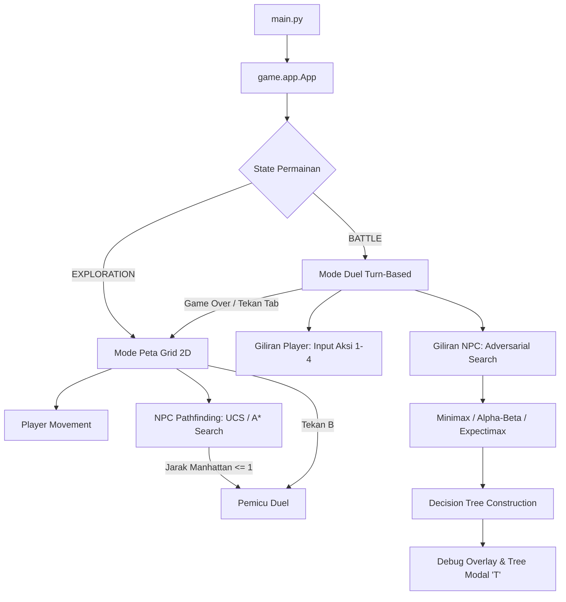

# Bakekok - Dokumentasi Teknis & Game AI (Tahap 1 & Tahap 2)

Proyek Tugas Besar Mata Kuliah Kecerdasan Buatan — Kelompok 7  
Program Studi Ilmu Komputer, Universitas Pendidikan Indonesia.

---

## 1. Identitas Proyek & Anggota Kelompok

- **Nama Game**: Bakekok
- **Mata Kuliah**: Kecerdasan Buatan
- **Kelompok**: 7 (Tubes AI)
- **Anggota Kelompok**:
  1. **Hanif Muyassar**
  2. **Moch Fadillah Pratama**
  3. **Muhammad Zidan Mirza Fedrieka**

---

## 2. Arsitektur Sistem & Struktur Kode

Sistem dikembangkan menggunakan Python 3.10+ berbasis kerangka `pygame-ce` dengan arsitektur modular yang memisahkan komponen *rendering*, *game loop*, *pathfinding engine*, *adversarial battle engine*, dan *interactive debug overlay*.

```
Game-AI/
├── main.py                     # Titik masuk utama aplikasi (Entry Point)
├── requirements.txt            # Daftar dependensi pustaka (pygame-ce)
├── assets/                     # Spritesheet dan aset grafis karakter/ubin
├── data/
│   └── map_tubes.json          # Metadata grid peta, layer ubin, atlas tile, dan rintangan
├── game/
│   ├── __init__.py             # Inisialisasi package game
│   ├── app.py                  # Main loop, penanganan event, kamera, state manager, dan arena render
│   ├── battle_ai.py            # Engine AI duel: BattleState, TreeNode, Minimax, Alpha-Beta, Expectimax
│   ├── battle_system.py        # Manajer giliran duel, kalkulasi damage, cooldown, dan logging aksi
│   ├── config.py               # Konstanta visual, palet warna, ukuran window, batas nilai, dan path aset
│   ├── events.py               # Event dispatcher untuk komunikasi antar-komponen (GameManager)
│   ├── mapdata.py              # Parser map_tubes.json, surface builder, koordinat grid, dan step cost
│   ├── npc.py                  # Entitas NPC: pergerakan halus, pemicu duel, path tracking
│   ├── overlay.py              # Debug overlay panel kiri (statistik pathfinding dan parameter duel)
│   ├── player.py               # Entitas Player (Bolu): pergerakan grid 4 arah, sprite renderer
│   ├── search.py               # Engine pathfinding: UCS, A*, PathNode, PriorityQueue, GridManager
│   └── tree_overlay.py         # Visualisasi Decision Tree AI (Smooth Bezier, Anti-Overlap, Pan 2D)
└── scratch/
    ├── analyze_map.py          # Utilitas inspeksi karakteristik peta
    ├── run_experiments.py      # Skrip eksekusi benchmark otomatis & pencatatan data performa AI
    └── test_depth.py           # Skrip pengujian skenario taktis AI pada variasi kedalaman
```

### Alur Eksekusi Permainan



---

## 3. Tahap 1: Pathfinding & Algoritma Pencarian Jalur

### 3.1 Model Grid & Weighted Terrain Cost
Peta permainan direpresentasikan sebagai grid 2D $N \times M$ dengan ukuran ubin $16 \times 16$ piksel. Data peta dibaca dari `data/map_tubes.json` yang memiliki empat layer: `ground`, `decorations`, `obstacles`, dan `water`.

Setiap sel walkable memiliki biaya langkah (*step cost*) $c(n)$ yang berbeda berdasarkan tipe medannya:

$$c(n) = \begin{cases} 
1.0, & \text{jika } n \in \text{Jalan Tanah (Dirt Road / Jembatan)} \\
2.0, & \text{jika } n \in \text{Rumput / Medan Umum (Grass)} \\
\infty, & \text{jika } n \in \text{Rintangan (Obstacle / Non-walkable)}
\end{cases}$$

**Identifikasi tipe medan** dilakukan di `mapdata.py` dengan fungsi `_is_dirt_road_cell()` yang memeriksa nama aset tile dan koordinat atlas:
- Tile `"Wood Bridge"` → Jalan Tanah (cost 1.0)
- Tile `"Ext_10a_DEMO"` dengan koordinat atlas `(11,12)` atau baris atlas `2 ≤ ay ≤ 4` → Jalan Tanah (cost 1.0)
- Semua tile lainnya → Rumput (cost 2.0)

**Walkable cell** = `ground` − `obstacles` − `water`

### 3.2 Algoritma Pencarian Jalur

1. **Uniform Cost Search (UCS)**:
   Algoritma pencarian tak diinformasikan (*uninformed search*) yang mengekspansi node berdasarkan akumulasi biaya jalur riwayat terendah $g(n)$ dari titik awal. Tidak menggunakan heuristik ($h(n) = 0$).
   
   Fungsi evaluasi node:
   $$f(n) = g(n), \quad g(n) = g(\text{parent}(n)) + c(n)$$

   **Properti:** Complete ✓, Optimal ✓ (karena cost ≥ 0).

2. **A\* Search**:
   Algoritma pencarian diinformasikan (*informed search*) yang menggabungkan akumulasi biaya riwayat $g(n)$ dengan estimasi jarak heuristik $h(n)$.
   
   Fungsi evaluasi node:
   $$f(n) = g(n) + h(n)$$
   
   *Tie-breaking rule*: Jika dua node memiliki nilai $f(n)$ identik, node dengan $h(n)$ lebih kecil diprioritaskan:
   $$\text{Priority}(n) = (f(n), h(n))$$

   **Properti:** Complete ✓, Optimal ✓ (jika $h$ admissible).

### 3.3 Formulasi Matematika Fungsi Heuristik $h(n)$
Fungsi heuristik $h(n)$ memperkirakan jarak terpendek dari posisi saat ini $a = (x_a, y_a)$ ke target $b = (x_b, y_b)$:

1. **Manhattan Distance**:
   $$h_{\text{Manhattan}}(a, b) = |x_a - x_b| + |y_a - y_b|$$

2. **Euclidean Distance**:
   $$h_{\text{Euclidean}}(a, b) = \sqrt{(x_a - x_b)^2 + (y_a - y_b)^2}$$

3. **Chebyshev Distance**:
   $$h_{\text{Chebyshev}}(a, b) = \max(|x_a - x_b|, |y_a - y_b|)$$

Semua heuristik bersifat **admissible** sehingga A\* dijamin optimal. Pada peta yang sama, UCS dan semua varian A\* menghasilkan jalur yang **identik dan optimal** — perbedaan hanya pada jumlah node yang diekspansi (A\* jauh lebih efisien).

---

## 4. Tahap 2: Duel Turn-Based NPC vs Player (Adversarial Search)

### 4.1 Pemicu Transisi Duel
Pertarungan otomatis dipicu ketika jarak Manhattan antara Player dan NPC bernilai $\le 1$, atau melalui tombol pintas `[B]`:

$$d_{\text{Manhattan}}(\text{Player}, \text{NPC}) = |x_{\text{player}} - x_{\text{npc}}| + |y_{\text{player}} - y_{\text{npc}}| \le 1$$

### 4.2 Formulasi Formal State Space ($S$) & State Vector
Ruang keadaan (*State Space*) $S$ mencakup seluruh konfigurasi posisi pertarungan yang mungkin. Suatu keadaan direpresentasikan sebagai *State Vector* $s$:

$$s = \langle HP_{\text{player}}, HP_{\text{npc}}, Pot_{\text{player}}, Pot_{\text{npc}}, Def_{\text{player}}, Def_{\text{npc}}, Turn, CD_{\text{player}}, CD_{\text{npc}} \rangle$$

Batasan variabel state:
- $HP_{\text{player}}, HP_{\text{npc}} \in [0, 100]$: Status kesehatan petarung.
- $Pot_{\text{player}}, Pot_{\text{npc}} \in [0, 3]$: Cadangan potion pemulih (stok awal = 2, maksimal = 3).
- $Def_{\text{player}}, Def_{\text{npc}} \in \{\text{True}, \text{False}\}$: Status posisi mempertahankan diri.
- $Turn \in \{\text{MAX (NPC)}, \text{MIN (Player)}\}$: Hak giliran petarung.
- $CD_{\text{player}}, CD_{\text{npc}} \in [0, 2]$: Sisa giliran *cooldown* serangan `HEAVY_ATTACK`.

### 4.3 Ruang Aksi ($A(s)$) & Branching Factor ($b \le 4$)
*Branching Factor* ($b$) adalah jumlah pilihan aksi legal yang dapat diambil dari suatu state node. Pada pertarungan ini, $b \le 4$:

1. **`ATTACK`**: Serangan standar ($D_{\text{base}} = 18$).
2. **`HEAVY_ATTACK`**: Serangan kuat ($D_{\text{base}} = 30$, legal jika $CD = 0$, memicu $CD \leftarrow 2$).
3. **`DEFEND`**: Memasang posisi bertahan (mereduksi kerusakan yang masuk sebesar $65\%$).
4. **`POTION`**: Memulihkan $+25$ HP (legal jika $Pot > 0$ dan $HP < 100$).

Perhitungan kerusakan efektif $D_{\text{effective}}$:

$$D_{\text{effective}} = \begin{cases} 
D_{\text{base}} \times (1 - 0.65) = \lfloor D_{\text{base}} \times 0.35 \rceil, & \text{jika target } Def = \text{True} \\
D_{\text{base}}, & \text{jika target } Def = \text{False}
\end{cases}$$

### 4.4 Terminal Test & Utility Function ($U(s)$)
*Terminal Test* menguji apakah pertarungan telah berakhir ($HP \le 0$). *Utility Function* $U(s)$ memberikan skor numerik mutlak pada keadaan akhir bagi agen MAX (NPC):

$$Terminal(s) = (HP_{\text{player}} \le 0) \lor (HP_{\text{npc}} \le 0)$$

$$U(s) = \begin{cases} 
+1000 + HP_{\text{npc}}, & \text{jika } HP_{\text{player}} \le 0 \land HP_{\text{npc}} > 0 \quad (\text{NPC Menang}) \\
-1000 - HP_{\text{player}}, & \text{jika } HP_{\text{npc}} \le 0 \land HP_{\text{player}} > 0 \quad (\text{Player Menang}) \\
0, & \text{jika } HP_{\text{player}} \le 0 \land HP_{\text{npc}} \le 0 \quad (\text{Seri})
\end{cases}$$

### 4.5 Depth Limit & Evaluation Function ($Eval(s)$)
Ketika pencarian mencapai batas kedalaman (*Depth Limit*), pencarian dihentikan (*early stop*) dan skor heuristik dibangkitkan oleh *Evaluation Function* $Eval(s)$ untuk memperkirakan keuntungan state:

1. **Balanced Evaluation (Seimbang / Standar)**:
   $$Eval_{\text{bal}}(s) = 2.0 \times (HP_{\text{npc}} - HP_{\text{player}}) + 12.0 \times (Pot_{\text{npc}} - Pot_{\text{player}}) + I(Def_{\text{npc}} \land HP_{\text{player}} > 20) \times 5.0$$

2. **Aggressive Evaluation (Penyerang / Ofensif)**:
   $$Eval_{\text{agg}}(s) = 4.0 \times (100 - HP_{\text{player}}) - 1.2 \times (100 - HP_{\text{npc}}) + 4.0 \times Pot_{\text{npc}} + I(HP_{\text{player}} \le 30) \times 35.0$$

3. **Defensive Evaluation (Bertahan / Taktis)**:
   $$Eval_{\text{def}}(s) = 3.0 \times HP_{\text{npc}} - 1.5 \times HP_{\text{player}} + 20.0 \times Pot_{\text{npc}} + I(Def_{\text{npc}}) \times 15.0 - I(HP_{\text{npc}} < 40 \land Pot_{\text{npc}} > 0) \times 25.0$$

### 4.6 Algoritma Pencarian Adversarial

#### 4.6.1 Pure Minimax (Minimax Murni)
Algoritma pencarian adversarial berbasis penelusuran mendalam (*Depth-First Search*) yang mengeksplorasi seluruh kemungkinan cabang permainan dua pemain *zero-sum* dengan kompleksitas waktu $O(b^d)$ dan ruang $O(b \cdot d)$.

Formula rekursif Minimax:
$$V(s) = \begin{cases} 
U(s), & \text{jika } Terminal(s) \\
Eval(s), & \text{jika depth} = 0 \\
\max_{a \in A(s)} V(\delta(s, a)), & \text{jika } Turn = \text{MAX (NPC)} \\
\min_{a \in A(s)} V(\delta(s, a)), & \text{jika } Turn = \text{MIN (Player)}
\end{cases}$$

#### 4.6.2 Alpha-Beta Pruning (Pemangkasan Alfa-Beta)
Teknik optimasi yang memotong cabang pohon pencarian yang tidak mempengaruhi keputusan akhir dengan mempertahankan batas bawah $\alpha$ (kepastian terbaik MAX) dan batas atas $\beta$ (kepastian terbaik MIN). Pemangkasan menurunkan kompleksitas waktu kasus terbaik dari $O(b^d)$ menjadi $O(b^{d/2})$.

Kondisi pemangkasan (*Cutoff Condition*):
- Pada node MIN, jika $V(s') \le \alpha$, lakukan $\beta$-cutoff.
- Pada node MAX, jika $V(s') \ge \beta$, lakukan $\alpha$-cutoff.

#### 4.6.3 Heuristic Move Ordering (Pengurutan Aksi)
Teknik mengurutkan cabang aksi paling menjanjikan terlebih dahulu di root/intermediate node agar batas $\alpha$ dan $\beta$ terdorong ke nilai ekstrem lebih cepat, sehingga memicu kondisi *cutoff* lebih awal.

Varian pengurutan aksi:
- **`OFF`**: Urutan deklaratif alami `[ATTACK, HEAVY_ATTACK, DEFEND, POTION]`.
- **`HEURISTIC` (Ofensif)**:
  - Node MAX (NPC): `HEAVY_ATTACK` $\succ$ `ATTACK` $\succ$ `POTION` $\succ$ `DEFEND`.
  - Node MIN (Player): `HEAVY_ATTACK` $\succ$ `ATTACK` $\succ$ `DEFEND` $\succ$ `POTION`.
- **`REVERSED` (Defensif / Terbalik)**: Urutan berlawanan dari heuristik ofensif untuk pengujian batas terburuk pemangkasan.

#### 4.6.4 Expectimax Search (Pencarian Stokastik)
Variasi pencarian adversarial untuk lingkungan tidak pasti/probabilistik. Cabang aksi stokastik digantikan oleh *Chance Node* yang menghitung *Expected Value* (rata-rata tertimbang probabilitas).

Pada Bakekok, `HEAVY_ATTACK` memiliki akurasi mendarat $75\%$ ($P_{\text{hit}} = 0.75$) dan meleset $25\%$ ($P_{\text{miss}} = 0.25$):
$$V_{\text{Expectimax}}(s, \text{HEAVY}) = 0.75 \times V(\delta(s, \text{HEAVY}_{\text{hit}})) + 0.25 \times V(\delta(s, \text{HEAVY}_{\text{miss}}))$$

---

## 5. Hasil Pengujian Benchmark & Analisis Kinerja

### 5.1 Perbandingan Pure Minimax vs Alpha-Beta Pruning
Hasil benchmark pada berbagai batas kedalaman (*depth limit 1 s/d 6*):

| Depth | Node Minimax | Node Alpha-Beta | Pemangkasan Cabang (%) | Waktu Minimax (ms) | Waktu Alpha-Beta (ms) | Keputusan Identik? |
|:---:|:---:|:---:|:---:|:---:|:---:|:---:|
| 1 | 4 | 4 | 0.0 % | 0.07 ms | 0.04 ms | True |
| 2 | 20 | 20 | 0.0 % | 0.07 ms | 0.09 ms | True |
| 3 | 82 | 51 | 37.8 % | 0.20 ms | 0.09 ms | True |
| 4 | 327 | 142 | 56.6 % | 0.38 ms | 0.21 ms | True |
| 5 | 1,277 | 302 | 76.4 % | 1.52 ms | 0.51 ms | True |
| 6 | 4,983 | 712 | 85.7 % | 6.23 ms | 1.03 ms | True |

> **Analisis:** Alpha-Beta Pruning mampu memangkas simpul yang dikunjungi hingga **85.7%** pada Depth 6 dengan percepatan waktu eksekusi hingga **6x lipat**, tanpa mengubah nilai utilitas dan keputusan terbaik (*admissible & optimal*).

### 5.2 Dampak 3 Varian Move Ordering pada Alpha-Beta Pruning

| Depth | Tanpa Urutan (OFF) | Heuristik (Ofensif) | Reversed (Defensif) | Reduksi Heuristik vs OFF (%) |
|:---:|:---:|:---:|:---:|:---:|
| 3 | 63 | 50 | 73 | 20.6 % |
| 4 | 221 | 165 | 221 | 25.3 % |
| 5 | 537 | 379 | 546 | 29.4 % |
| 6 | 1,351 | 897 | 1,599 | 33.6 % |

> **Analisis:** Pengurutan aksi ofensif (`HEURISTIC`) memangkas simpul **33.6% lebih banyak** dibanding tanpa pengurutan (`OFF`) dan **43.9% lebih banyak** dibanding urutan terbalik (`REVERSED`) pada Depth 6.

### 5.3 Perbandingan Perilaku NPC pada 3 Profil Fungsi Evaluasi

| Skenario Pertarungan | Balanced Evaluation | Aggressive Evaluation | Defensive Evaluation |
|:---|:---:|:---:|:---:|
| **Netral (HP 100 vs 100)** | `ATTACK` (Skor: 0.0) | `ATTACK` (Skor: 0.0) | `ATTACK` (Skor: 0.0) |
| **NPC Sekarat (HP 25 vs 75, Pot: 2)** | `POTION` (Skor: -66.0) | `ATTACK` (Skor: -26.0) | `POTION` (Skor: -12.5) |
| **Player Sekarat (HP 70 vs 20)** | `ATTACK` (Skor: 120.0) | `HEAVY_ATTACK` (Skor: 275.0) | `ATTACK` (Skor: 145.0) |

> **Analisis:** Profil *Aggressive* mengabaikan pemulihan saat HP kritis untuk mengejar eliminasi lawan, sedangkan profil *Defensive* memprioritaskan konservasi HP melalui `POTION` dan `DEFEND`.

### 5.4 Perbandingan Deterministik vs Expectimax (Skor Aksi Root Node)

| Aksi Legal | Skor Deterministik (Alpha-Beta) | Skor Probabilistik (Expectimax) | Keterangan Risiko |
|:---|:---:|:---:|:---|
| `ATTACK` | -46.0 | -14.25 | Serangan pasti (100% hit) |
| `HEAVY_ATTACK` | 22.0 | 3.94 | Risiko 25% meleset diperhitungkan |
| `DEFEND` | -38.0 | -38.0 | Reduksi 65% deterministik |
| `POTION` | -22.0 | -7.0 | Pemulihan pasti +25 HP |

---

## 6. Antarmuka Pengguna & Kontrol Permainan

### 6.1 Mode Eksplorasi (Peta Grid)
- **`[W, A, S, D]` / `[Tombol Panah]`**: Menggerakkan Player (Bolu) pada grid.
- **`[Spasi]`**: Memanggil NPC Kucing agar mengejar posisi Player via pathfinding.
- **`[B]`**: Masuk instan ke Mode Duel.
- **`[Esc]`**: Keluar dari permainan.

### 6.2 Mode Duel (Pertarungan Turn-Based)
- **`[1 / A]`**: Eksekusi aksi `ATTACK` (18 damage).
- **`[2 / S]`**: Eksekusi aksi `HEAVY_ATTACK` (30 damage, cooldown 2 giliran).
- **`[3 / D]`**: Eksekusi aksi `DEFEND` (mereduksi damage masuk 65%).
- **`[4 / W]`**: Eksekusi aksi `POTION` (+25 HP heal, batas 3 potion).
- **`[R]`**: Reset / mulai ulang duel.
- **`[T]` / Klik Tombol Panel**: Tampilkan / sembunyikan **Decision Tree Overlay**.
- **`[Tab]`**: Kembali ke Mode Eksplorasi Peta.

### 6.3 Interaksi Decision Tree Overlay & Debug Panel
- **Tampilan Pohon Keputusan (`[T]`)**:
  - Garis penghubung antialiased kurva Bezier kubik mulus.
  - Kartu simpul rapi berujung membulat (*rounded rect*) dengan bayangan lembut (*ambient shadow*).
  - Teks skor dipadatkan secara adaptif (`+1070`, `-1057`, `0`) untuk mencegah teks keluar dari kotak.
  - **Navigasi Panning 2D**: Tahan klik kiri dan geser mouse (*mouse drag*), atau gunakan tombol panah `[▲ ▼ ◀ ▶]`.
  - **Scroll Vertikal**: Gunakan *scroll wheel* mouse.
  - **Tutup Modal**: Tekan `[T]`, `[Esc]`, atau klik tombol `[X TUTUP]`.
- **Panel Debug Sidebar**:
  - Tombol interaktif untuk mengganti Algoritma AI (`MINIMAX`, `ALPHA_BETA`, `EXPECTIMAX`).
  - Tombol untuk mengganti Fungsi Evaluasi (`BALANCED`, `AGGRESSIVE`, `DEFENSIVE`).
  - Tombol untuk mengganti Move Ordering (`OFF`, `HEURISTIC`, `REVERSED`).
  - Slider/tombol pengaturan kedalaman pencarian (*Depth Limit 1 s/d 6*).
  - Komparasi simpul langsung (*side-by-side node count & % savings*).
  - Indikator status giliran: `"Menunggu Input Aksi..."` saat giliran pemain.

---

## 7. Panduan Instalasi & Eksekusi

### 7.1 Persyaratan Sistem
- Python 3.10 atau versi yang lebih baru.
- Sistem Operasi: Windows, macOS, atau Linux.

### 7.2 Instalasi Dependensi
Buka terminal pada direktori proyek, kemudian pasang pustaka yang dibutuhkan:

```bash
pip install -r requirements.txt
```

### 7.3 Menjalankan Game
Untuk menjalankan game Bakekok secara interaktif:

```bash
python main.py
```

### 7.4 Menjalankan Skrip Benchmark AI
Untuk menjalankan pengujian benchmark otomatis (Eksperimen 1 s/d 4):

```bash
python scratch/run_experiments.py
```

---